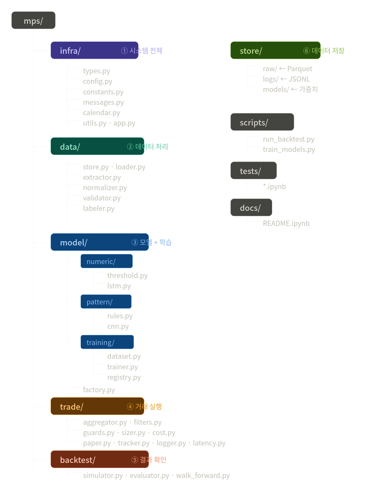

# MPP: Muse Pulse Project

1. **(프로젝트 목표)** AI를 이용해 우리나라 주식 시장에서 주식이 오르가나 떨어지는 구간의 패턴을 파악하고 해당 시점에 주식을 매도나 매수할 수 있는 주식거래 자동화 시스템(MPS, Muse Pulse System)을 설계하는 프로젝트

1. **(MP, Muse Pulse 란?)** 시장 참여자의 뮤즈(muse, 아이디어·심리·의도)에서 살아있는 펄스(pulse, 맥박·맥락)을 짚어낸다는 의미로, `참여자의 심리를 바로 찾아 거래를 주도한다`는 의미임

1. **(Version)** 1.0, 
1. **(Last updated)** 2026-04-30 18:13 freeman.cho@gamil.com

<br/>

# Usage:

* 먼저 모델 학습
```command
$ cd ~/projects/mps
$ python run/train_models.py [--ticker 005930] [--start 20250101] [--end 20251231]
```

* 학습 완료된 모델을 가지고 매매
```command
$ cd ~/projects/mps
$ python run/backtest.py [--ticker 005930] [--start 20250101] [--end 20251231]
```

<br/>

# Directories:

